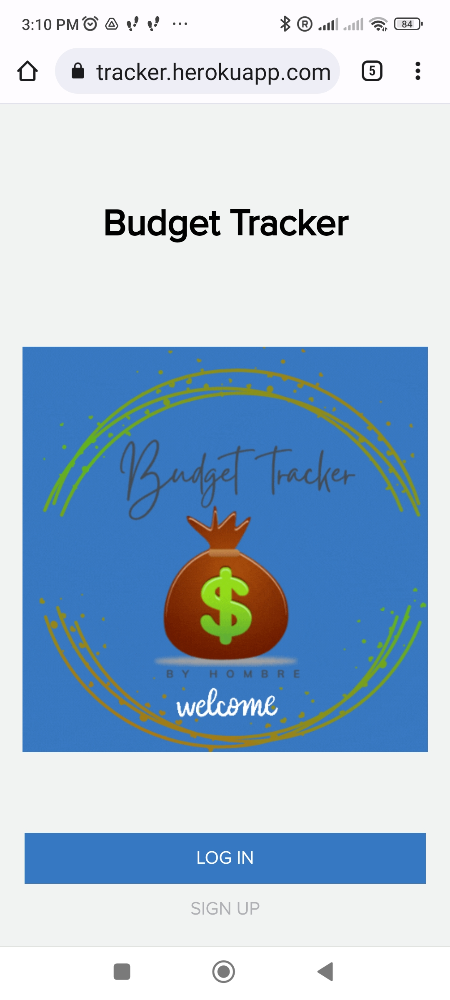
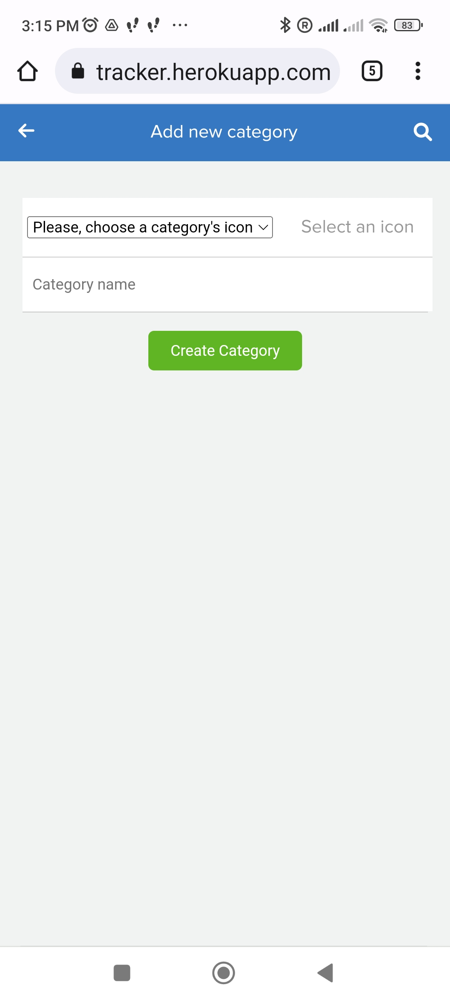

# Budget mobile app

>  Ruby or Rails capstone project

## Description

The Ruby on Rails capstone project is about building a mobile web application where you can manage your budget: you have a list of transactions associated with a category, so that you can see how much money you spent and on what. 

You will create a Ruby on Rails application that allows the user to:
- register and log in, so that the data is private to them.
- introduce new transactions associated with a category.
- see the money spent on each category.

  

## Project requirements

The project requirements can be viewed [here](https://github.com/microverseinc/curriculum-rails/blob/main/capstone/rails_capstone.md)

#### Design
- You should follow these [design guidelines](https://www.behance.net/gallery/19759151/Snapscan-iOs-design-and-branding?tracking_source=), including:
  - Colors.
  - Typography: font face, size and weight.
  - Layout: composition and space between elements.

> NOTE: In these design guidelines there are several UIs that you won't need for this exercise; also, some pages are not given a design and you will create them following the design guidelines of the other pages.

## Video presentation

Watch the [video](https://www.loom.com/share/413ed62336e248ee9cf4aba3901917c9)

## Screenshots

## Built With

- Languages: Ruby
- Framework: Ruby on Rails
- Database: PostgreSQL

## Usage

Run the following commands: 
`git clone https://github.com/Hombre2014/Budget.git` 
`cd Budget` 
`bundle install` 
`rails s` 
Open a browser and go to: `https://localhost:3000` to view the app.

## Database setup

To start with clean database use:

`cd Budget` 
`rails db:drop db:create db:migrate`

## Testing

`cd Budget` 
run `rspec`

## Author

👤 **Yuriy Chamkoriyski**

- GitHub: [@Hombre2014](https://github.com/Hombre2014)
- Twitter: [@Chamkoriyski](https://twitter.com/Chamkoriyski)
- LinkedIn: [axebit](https://linkedin.com/in/axebit)

## 🤝 Contributing

Contributions, issues, and feature requests are welcome!

Feel free to check the [issues page](https://github.com/Hombre2014/Budget/issues).

## Show your support

Give a ⭐️ if you like this project!

## Acknowledgments

The original design idea by [Gregoire Vella on Behance](https://www.behance.net/gregoirevella) under [Creative Commons license of the design](https://creativecommons.org/licenses/by-nc/4.0/). [License](https://creativecommons.org/licenses/by-nc/4.0/legalcode)

## 📝 License

This project is [MIT](./license.md) licensed.
